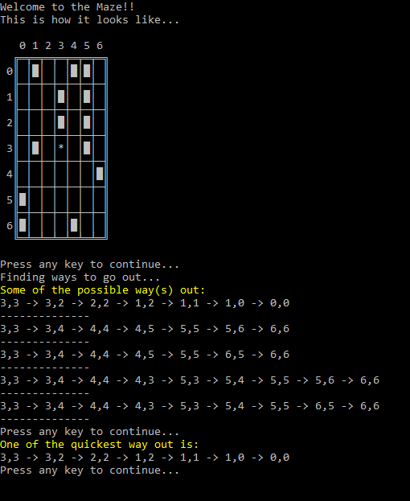

# Interesting Maze
This is a proof of concept (POC) developed using **C#** using the concept of the **Stack**, to build a dynamic maze with walls or obstacles and to find the shortest point of exit from a given starting point.

### Sample Output

### Troubleshooting
* While debugging the code, if _Console.ReadLine_ does not stop and wait for user input, change the project properties.
* Go to Project Properties -> Select **Run on external console** and also **Pause console output**.